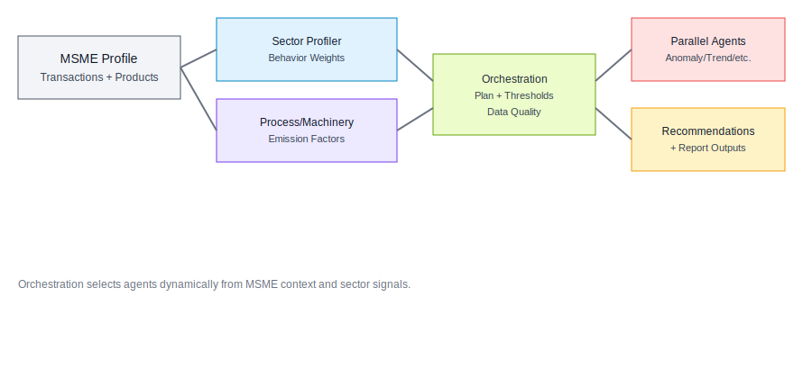
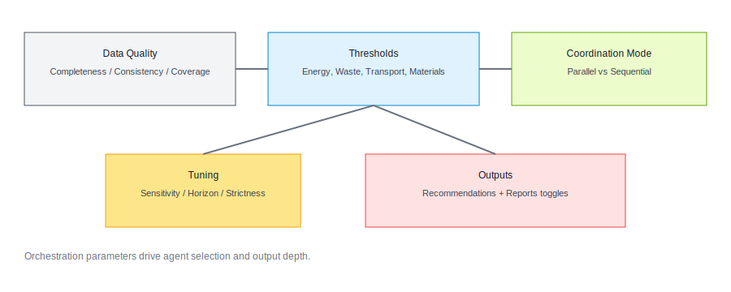

# AI Agents System Documentation

## Overview

The Carbon Intelligence backend now includes a comprehensive multi-AI agent system designed to enhance carbon footprint analysis, provide intelligent recommendations, and automate various sustainability-related tasks. The system consists of specialized AI agents that work together to provide advanced carbon intelligence capabilities.

## Architecture

### Core Components

1. **AI Agent Service** (`src/services/aiAgentService.js`)
   - Central orchestration service for all AI agents
   - Task queue management and distribution
   - Agent communication and coordination
   - Performance monitoring and optimization

2. **AI Agent Models**
   - `AIAgent` - Agent configuration and metadata
   - `AITask` - Individual task management
   - `AIWorkflow` - Multi-step workflow definitions
   - `AIExecution` - Workflow execution tracking

3. **Specialized Agents**
   - Carbon Analyzer Agent
   - Recommendation Engine Agent
   - Data Processor Agent
   - Anomaly Detector Agent
   - Trend Analyzer Agent
   - Compliance Monitor Agent
   - Optimization Advisor Agent
   - Report Generator Agent
   - Sector Profiler Agents (per MSME business domain)

## AI Agents

### 1. Carbon Analyzer Agent
**Type:** `carbon_analyzer`
**Purpose:** Advanced carbon footprint analysis and sustainability assessment

**Capabilities:**
- Transaction-based carbon emission calculation
- ESG scope classification (Scope 1, 2, 3)
- Carbon scoring and sustainability assessment
- Anomaly detection in emission patterns
- Industry-specific analysis

**API Endpoints:**
- `POST /api/ai-agents/analyze-carbon` - Trigger carbon analysis
- `GET /api/ai-agents/:id/performance` - Get agent performance metrics

### 2. Recommendation Engine Agent
**Type:** `recommendation_engine`
**Purpose:** Generate personalized sustainability recommendations

**Capabilities:**
- Sustainability improvement suggestions
- Cost-benefit analysis for recommendations
- Priority-based recommendation ranking
- Industry-specific recommendations
- Implementation guidance

**API Endpoints:**
- `POST /api/ai-agents/generate-recommendations` - Generate recommendations
- `GET /api/ai-agents/:id/tasks` - Get recommendation tasks

### 3. Data Processor Agent
**Type:** `data_processor`
**Purpose:** Clean, classify, and enrich transaction data

**Capabilities:**
- Transaction data cleaning and validation
- Automatic category classification
- Text analysis and keyword extraction
- Data enrichment with sustainability metrics
- Quality validation and error detection

**API Endpoints:**
- `POST /api/ai-agents/process-data` - Process transaction data
- `GET /api/ai-agents/:id/tasks` - Get processing tasks

### 4. Anomaly Detector Agent
**Type:** `anomaly_detector`
**Purpose:** Detect unusual patterns and anomalies in data

**Capabilities:**
- Emission pattern analysis
- Spending anomaly detection
- Frequency pattern analysis
- Risk assessment
- Alert generation

### 5. Trend Analyzer Agent
**Type:** `trend_analyzer`
**Purpose:** Analyze trends and patterns in sustainability data

**Capabilities:**
- Emission trend analysis
- Efficiency trend tracking
- Seasonal pattern recognition
- Predictive forecasting
- Performance benchmarking

### 6. Compliance Monitor Agent
**Type:** `compliance_monitor`
**Purpose:** Monitor environmental compliance and regulatory requirements

**Capabilities:**
- Environmental regulation compliance checking
- Gap analysis and reporting
- Audit preparation
- Regulatory change monitoring
- Compliance scoring

### 7. Optimization Advisor Agent
**Type:** `optimization_advisor`
**Purpose:** Provide optimization suggestions for processes and resources

**Capabilities:**
- Process optimization recommendations
- Resource efficiency improvements
- Cost reduction strategies
- Energy optimization suggestions
- Waste reduction plans

### 8. Report Generator Agent
**Type:** `report_generator`
**Purpose:** Generate comprehensive reports and visualizations

**Capabilities:**
- Automated report generation
- Data visualization creation
- Chart and graph generation
- Multi-format export (PDF, Excel, JSON)
- Customizable report templates

### 9. Unified Sector Profiler Agent
**Type:** `sector_profiler`
**Purpose:** Build sector-specific MSME profiles and guide dynamic orchestration

**Sub-agents (internal):**
- Sector classifier
- Behavior weighting planner
- Orchestration planning advisor

**Capabilities:**
- Sector profile analysis for registered MSMEs
- Behavior weighting by MSME business domain
- Orchestration planning recommendations
- Context enrichment for multi-agent coordination

### 10. Unified Process & Machinery Profiler Agent
**Type:** `process_machinery_profiler`
**Purpose:** Identify sector processes, machinery, and emissions generation factors

**Sub-agents (internal):**
- Process mapper
- Machinery inventory builder
- Emission factor hinting

**Capabilities:**
- Process mapping based on MSME profile and products
- Machinery inventory and operational signals
- Emission factor hints for energy, transport, and materials
- Context enrichment for optimization and compliance agents

## API Endpoints

### AI Agent Management

#### Get All Agents
```http
GET /api/ai-agents
Authorization: Bearer <token>
Query Parameters:
- type: Filter by agent type
- status: Filter by status (active, inactive, maintenance, error)
- isActive: Filter by active status (true/false)
```

#### Get Single Agent
```http
GET /api/ai-agents/:id
Authorization: Bearer <token>
```

#### Create Agent (Admin Only)
```http
POST /api/ai-agents
Authorization: Bearer <token>
Content-Type: application/json

{
  "name": "Custom Agent",
  "type": "carbon_analyzer",
  "description": "Custom carbon analysis agent",
  "capabilities": ["carbon_analysis", "emission_calculation"],
  "configuration": {
    "model": "custom_model_v1",
    "parameters": {
      "threshold": 0.8
    }
  }
}
```

#### Update Agent (Admin Only)
```http
PUT /api/ai-agents/:id
Authorization: Bearer <token>
Content-Type: application/json

{
  "description": "Updated description",
  "configuration": {
    "model": "updated_model_v2"
  }
}
```

#### Delete Agent (Admin Only)
```http
DELETE /api/ai-agents/:id
Authorization: Bearer <token>
```

### AI Task Management

#### Create Task for Agent
```http
POST /api/ai-agents/:id/tasks
Authorization: Bearer <token>
Content-Type: application/json

{
  "taskType": "carbon_analysis",
  "input": {
    "transactions": [...],
    "msmeData": {...}
  },
  "priority": "high"
}
```

#### Get Agent Tasks
```http
GET /api/ai-agents/:id/tasks
Authorization: Bearer <token>
Query Parameters:
- status: Filter by task status
- limit: Number of tasks per page (default: 10)
- page: Page number (default: 1)
```

#### Get Agent Performance
```http
GET /api/ai-agents/:id/performance
Authorization: Bearer <token>
```

### Specialized AI Operations

#### Carbon Analysis
```http
POST /api/ai-agents/analyze-carbon
Authorization: Bearer <token>
Content-Type: application/json

{
  "transactions": [
    {
      "category": "energy",
      "amount": 1000,
      "description": "Electricity bill",
      "date": "2024-01-15"
    }
  ],
  "msmeData": {
    "industry": "manufacturing",
    "employeeCount": 50
  }
}
```

#### Generate Recommendations
```http
POST /api/ai-agents/generate-recommendations
Authorization: Bearer <token>
Content-Type: application/json

{
  "carbonData": {
    "breakdown": {
      "energy": { "total": 500 }
    }
  },
  "transactions": [...],
  "msmeData": {...}
}
```

#### Process Data
```http
POST /api/ai-agents/process-data
Authorization: Bearer <token>
Content-Type: application/json

{
  "transactions": [
    {
      "description": "Raw material purchase",
      "amount": 5000,
      "vendor": "Material Supplier"
    }
  ]
}
```

#### Contextual MSME Emissions Orchestration
```http
POST /api/ai-agents/orchestrate-msme-emissions
Authorization: Bearer <token>
Content-Type: application/json

{
  "msmeId": "64ff1d2a01a3b1a0e1234567",
  "transactions": [
    {
      "category": "energy",
      "amount": 1250,
      "description": "Grid electricity bill"
    }
  ],
  "behaviorOverrides": {
    "transportation": {
      "totalEmissions": 120.5
    }
  },
  "contextOverrides": {
    "season": "monsoon"
  }
}
```

### Orchestration Overview


### Orchestration Parameters


### AI-Enhanced Carbon Analysis

#### Comprehensive AI Analysis
```http
POST /api/carbon/ai-analyze
Authorization: Bearer <token>
Content-Type: application/json

{
  "transactions": [...],
  "msmeData": {...},
  "analysisType": "comprehensive",
  "includeRecommendations": true,
  "includeAnomalyDetection": true
}
```

#### Get AI Task Results
```http
GET /api/carbon/ai-tasks/:taskId
Authorization: Bearer <token>
```

## Workflow Management

### AI Workflows

AI workflows allow you to chain multiple agents together to perform complex, multi-step analyses.

#### Get All Workflows
```http
GET /api/ai-workflows
Authorization: Bearer <token>
```

#### Create Workflow
```http
POST /api/ai-workflows
Authorization: Bearer <token>
Content-Type: application/json

{
  "name": "Carbon Assessment Workflow",
  "description": "Complete carbon footprint assessment",
  "trigger": {
    "type": "manual"
  },
  "steps": [
    {
      "stepId": "data_processing",
      "agentId": "agent_id_1",
      "taskType": "data_processing",
      "parameters": {}
    },
    {
      "stepId": "carbon_analysis",
      "agentId": "agent_id_2",
      "taskType": "carbon_analysis",
      "dependencies": ["data_processing"]
    }
  ]
}
```

#### Execute Workflow
```http
POST /api/ai-workflows/:id/execute
Authorization: Bearer <token>
Content-Type: application/json

{
  "triggerData": {
    "transactions": [...],
    "msmeData": {...}
  }
}
```

## Configuration

### Environment Variables

```bash
# MongoDB connection
MONGODB_URI=mongodb://localhost:27017/carbon-intelligence

# AI Agent Service Configuration
AI_AGENT_MAX_CONCURRENT_TASKS=5
AI_AGENT_TASK_TIMEOUT=300000
AI_AGENT_RETRY_ATTEMPTS=3

# Agent-specific configurations
CARBON_ANALYZER_MODEL=carbon_analysis_v1
RECOMMENDATION_ENGINE_MODEL=recommendation_v1
DATA_PROCESSOR_MODEL=data_processing_v1
```

### Agent Configuration

Each agent can be configured with specific parameters:

```javascript
{
  "configuration": {
    "model": "agent_model_v1",
    "parameters": {
      "threshold": 0.8,
      "maxResults": 10,
      "enableML": true
    },
    "thresholds": {
      "confidence": 0.7,
      "accuracy": 0.8
    },
    "preferences": {
      "language": "en",
      "timezone": "UTC"
    }
  }
}
```

## Performance Monitoring

### Agent Performance Metrics

Each agent tracks the following performance metrics:

- **Tasks Completed**: Total number of tasks processed
- **Success Rate**: Percentage of successfully completed tasks
- **Average Response Time**: Mean time to complete tasks
- **Error Count**: Number of failed tasks
- **Last Activity**: Timestamp of last task execution

### Task Monitoring

Tasks are monitored for:

- **Status**: pending, in_progress, completed, failed, cancelled
- **Processing Time**: Actual time taken to complete
- **Resource Usage**: CPU and memory consumption
- **Confidence Score**: AI confidence in results
- **Accuracy**: Validation accuracy score

## Error Handling

### Common Error Scenarios

1. **Agent Unavailable**: When an agent is offline or in maintenance
2. **Task Timeout**: When a task exceeds maximum processing time
3. **Invalid Input**: When input data doesn't meet requirements
4. **Dependency Failure**: When a workflow step fails due to dependency issues
5. **Resource Exhaustion**: When system resources are insufficient

### Error Response Format

```json
{
  "success": false,
  "message": "Error description",
  "error": {
    "code": "ERROR_CODE",
    "details": "Detailed error information",
    "timestamp": "2024-01-15T10:30:00Z"
  }
}
```

## Best Practices

### 1. Agent Selection
- Choose the most appropriate agent for your specific task
- Consider agent capabilities and performance metrics
- Use fallback mechanisms for critical operations

### 2. Task Management
- Set appropriate priority levels for tasks
- Monitor task status and handle failures gracefully
- Implement retry logic for transient failures

### 3. Workflow Design
- Design workflows with clear dependencies
- Avoid circular dependencies
- Include error handling and recovery steps

### 4. Performance Optimization
- Monitor agent performance metrics
- Scale agents based on demand
- Optimize task parameters for better results

### 5. Security
- Validate all input data
- Implement proper authentication and authorization
- Monitor for suspicious activity

## Troubleshooting

### Common Issues

1. **Agent Not Responding**
   - Check agent status and configuration
   - Verify agent dependencies
   - Review system resources

2. **Task Stuck in Pending**
   - Check task queue status
   - Verify agent availability
   - Review task parameters

3. **Poor Performance**
   - Monitor agent performance metrics
   - Check system resources
   - Optimize task parameters

4. **Workflow Failures**
   - Review step dependencies
   - Check individual step status
   - Verify input data format

### Debugging Tools

1. **Agent Status Dashboard**: Monitor all agents and their status
2. **Task Queue Monitor**: View pending and running tasks
3. **Performance Analytics**: Analyze agent and task performance
4. **Error Logs**: Review detailed error information

## Future Enhancements

### Planned Features

1. **Machine Learning Integration**: Enhanced ML models for better accuracy
2. **Real-time Processing**: Stream processing for immediate insights
3. **Advanced Analytics**: Predictive analytics and forecasting
4. **Custom Agent Development**: Tools for creating custom agents
5. **Integration APIs**: Third-party system integrations
6. **Mobile Support**: Mobile-optimized agent interactions

### Roadmap

- **Q1 2024**: Enhanced ML models and real-time processing
- **Q2 2024**: Advanced analytics and custom agent tools
- **Q3 2024**: Third-party integrations and mobile support
- **Q4 2024**: AI-powered insights and automation

## Support

For technical support and questions:

1. **Documentation**: Review this documentation and API references
2. **Logs**: Check application logs for detailed error information
3. **Monitoring**: Use built-in monitoring tools to diagnose issues
4. **Community**: Join the Carbon Intelligence community for discussions
5. **Support Team**: Contact the development team for critical issues

---

*This documentation is regularly updated. Please check for the latest version.*