# Carbon Intelligence Platform Architecture Diagrams

This document provides detailed architecture views for the Carbon Intelligence platform using Mermaid diagrams. It reflects the current implementation across web, mobile, backend services, AI orchestration, and persistence layers.

## 1) System Context Diagram

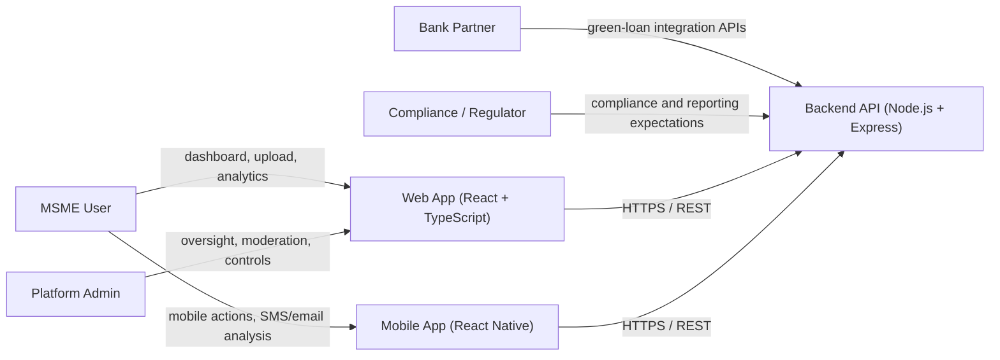

## 2) Container Architecture Diagram

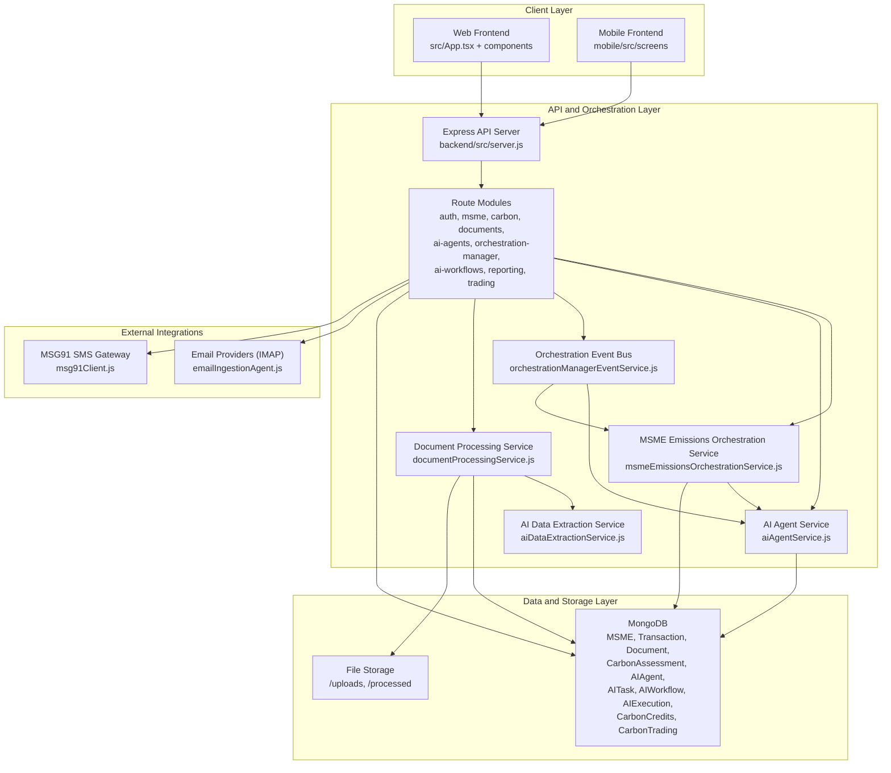

## 3) Backend Component Diagram (AI and Orchestration Core)

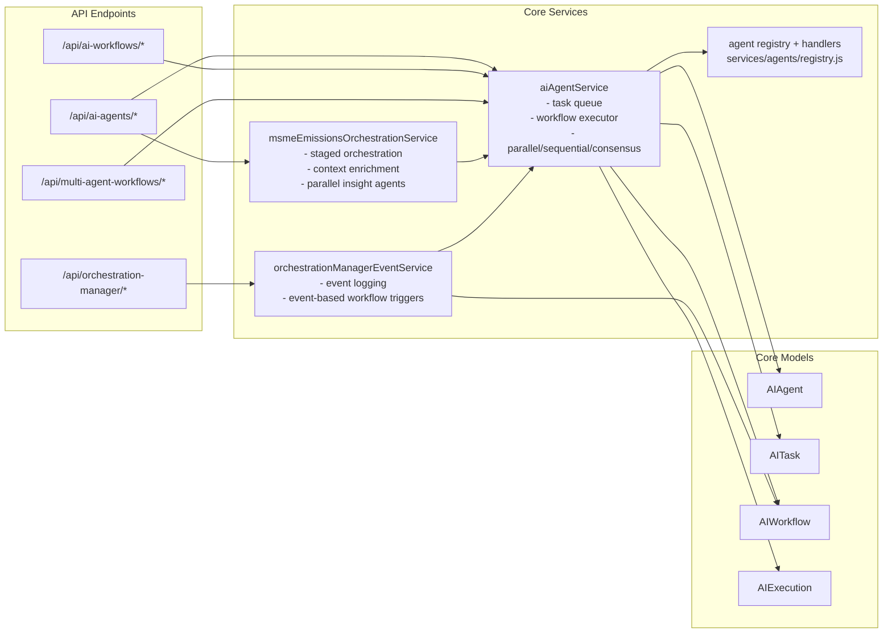

## 4) Workflow Diagram: End-to-End MSME Emissions Orchestration

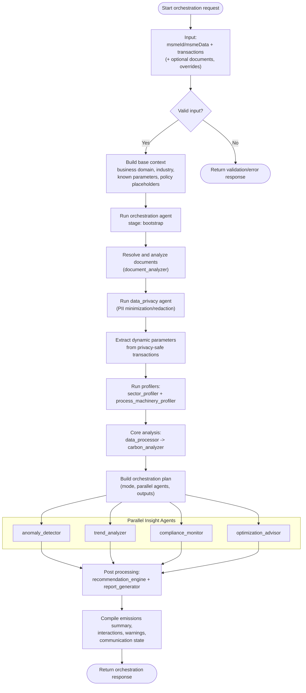

## 5) Sequence Diagram: `/api/ai-agents/orchestrate-msme-emissions`

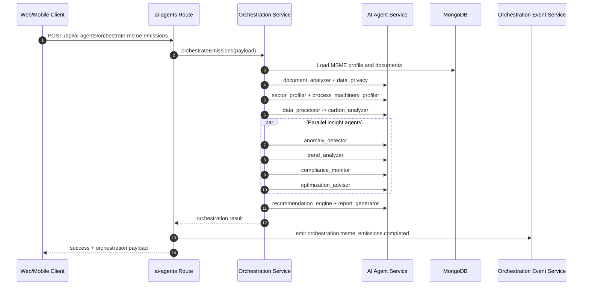

## 6) Workflow Diagram: Document Intelligence Pipeline

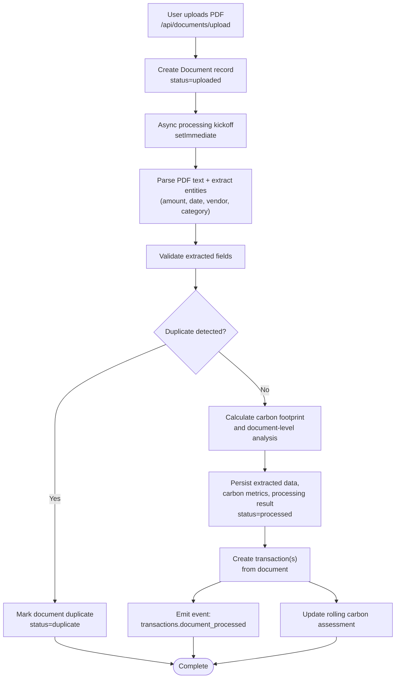

## 7) Workflow Diagram: Event-Driven Orchestration and Workflow Triggering

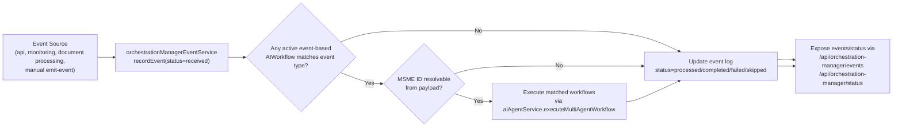

## 8) Use-Case Diagram (Platform Capabilities)

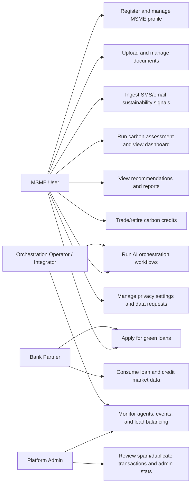

## 9) Data Model Relationship Diagram (Core Domains)

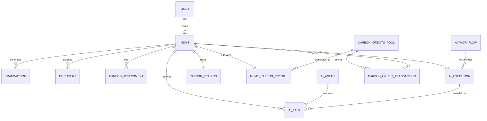

## 10) Deployment Topology Diagram

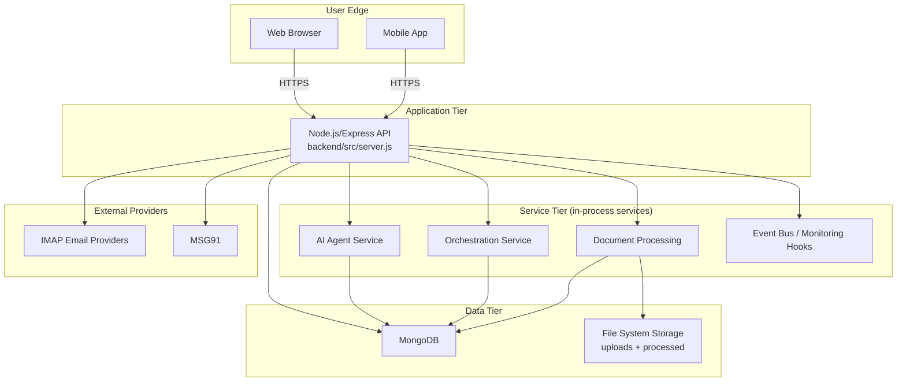

## 11) AI Task Lifecycle (State Diagram)

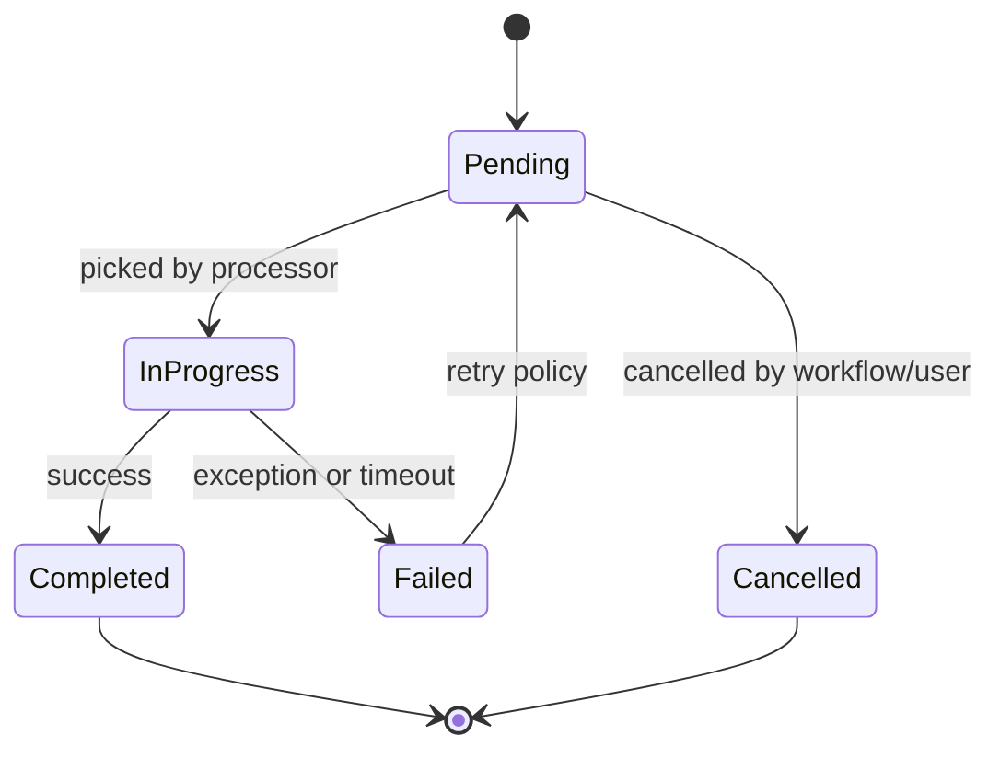

## 12) Observability and Control Feedback Loop

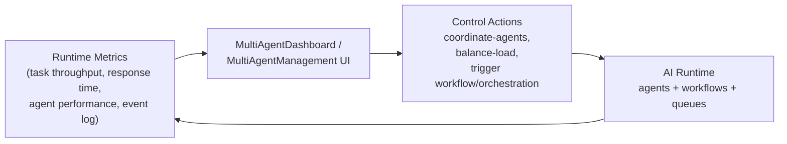

## Notes

- API aggregation entrypoint: `backend/src/server.js`
- Core orchestration engine: `backend/src/services/msmeEmissionsOrchestrationService.js`
- Multi-agent execution engine: `backend/src/services/aiAgentService.js`
- Event bus and event-driven workflows: `backend/src/services/orchestrationManagerEventService.js`
- Document processing pipeline: `backend/src/services/documentProcessingService.js`
- Frontend orchestration console: `src/components/MultiAgentManagement.tsx`

